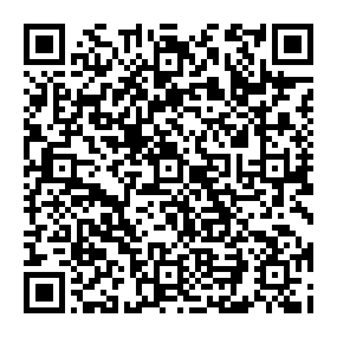

<div align="center">

# TabelaCal

**Agenda que se organiza por conversa: linguagem natural + IA traduzem suas mensagens para comandos do Google Calendar.**

[](https://kit.svelte.dev)
[](https://workers.cloudflare.com)
[](LICENSE)
[](https://github.com/TabelaDev/tabelawebui)

[](https://ko-fi.com/ianptkcs)

</div>

---

## O que é

A ideia desse app é facilitar e agilizar a organização da sua agenda, usando linguagem natural e IA para interpretar as suas mensagens e traduzir para a API do Google Calendar.

## Como funciona

1. Você escreve o que quer fazer, em linguagem natural, na tela de chat.
2. A IA traduz isso em um comando: listar, modificar, criar ou apagar eventos no seu Google Calendar e estrutura os dados de acordo com o que é esperado pela API.
3. Antes de qualquer mudança, um card de confirmação aparece, mostrando o que será feito (ex: criar um evento com título, data/hora, local e descrição). Você pode confirmar, modificar algum campo manualmente, pedir para a IA fazer um ajuste pontual ou cancelar.
4. Uma vez confirmado, o comando é executado automaticamente no seu Google Calendar e registrado temporariamente no banco do TabelaCal, para que você possa ver o histórico do que foi feito.

Também funciona como PWA: você pode "instalar" no celular ou no desktop e usar como um app nativo, com atualização automática (aparece um aviso quando uma versão nova for lançada).

## Traga suas próprias credenciais

Duas coisas que diferenciam o TabelaCal de um SaaS comum, ambas decisões de design bem deliberadas:

- A chave de IA é sua. No onboarding, você cola a sua própria API key e escolhe o provedor e o modelo que quiser usar. Em vez de cobrar uma mensalidade ou anuidade fixa, o TabelaCal deixa você ditar seu próprio custo: escolhendo um modelo mais barato ou mais caro, você decide quanto paga. Como o pagamento é feito direto para o provedor, não há qualquer tipo de taxa de operação do TabelaCal por cima.

  Provedores suportados hoje e onde gerar a chave:

  - **DeepSeek**: crie uma em [platform.deepseek.com/api_keys](https://platform.deepseek.com/api_keys) (a opção mais barata).
  - **Anthropic (Claude)**: crie uma em [console.anthropic.com/settings/keys](https://console.anthropic.com/settings/keys) (precisa de uma conta com créditos/billing configurado).
  - **OpenAI (ChatGPT)**: crie uma em [platform.openai.com/api-keys](https://platform.openai.com/api-keys) (idem, precisa de billing configurado na conta).

- O acesso ao Google Calendar também é seu. Se o TabelaCal tivesse um único "app do Google" compartilhado por todo mundo, mais cedo ou mais tarde ele passaria do limite de usuários de teste e precisaria da revisão/verificação do Google pra escopos sensíveis como o do Calendar, um processo que pode envolver auditoria de segurança paga, e esse custo teria que ser repassado pra alguém: ou pra quem hospeda o TabelaCal, ou pros usuários. Pra evitar isso, cada usuário cria seu próprio projeto no Google Cloud Console, ativa a API do Calendar nele e cola o Client ID/Secret gerados no TabelaCal. Como é um projeto individual, ele nunca chega perto do limite que exigiria verificação, ficando tudo gratuito, sem custo de infra pra ninguém. Como é um processo mais trabalhoso para quem não está acostumado em mexer com tecnologia, o app te guia por todo o processo em um onboarding. É uma configuração inicial e única.

Ou seja: o TabelaCal cuida do hosting, da UI e de orquestrar tudo, mas quem "paga a conta" da IA e é dono do próprio acesso ao Google é você.

## Funcionalidades

- **Onboarding guiado** em duas etapas: configurar a IA (chave + modelo) e conectar o Google Calendar (wizard explicando como criar o projeto no GCP).
- **Chat em linguagem natural** pra listar, criar, modificar, apagar ou responder convites de eventos em qualquer uma das suas agendas conectadas (não só a `primary`) — inclusive eventos que já existiam antes do TabelaCal — com card de confirmação antes de qualquer mudança real. Eventos recorrentes também são suportados (ex: "toda segunda às 9h até o fim do mês"), com opção de editar só uma ocorrência ou a série inteira.
- **Lembretes proativos**: notificação push ~30 minutos antes de um evento começar (opt-in na tela de histórico).
- **Histórico**: uma tela dedicada com tudo que já foi feito pelo app (independente do chat), de onde também dá pra excluir direto.
- **Login via Google**, sem cadastro separado de e-mail/senha, sua conta Google já é sua identidade no app.
- **PWA instalável**, com prompt de atualização quando versões novas são lançadas.
- Fuso horário detectado automaticamente do seu navegador no onboarding.

### O que ainda não tem, mas tá no radar

- Input por voz e por imagem.
- Outros calendários além do Google (Apple, Outlook).
- Criar evento por WhatsApp/Telegram.

Ver `ESCOPO.md` pra decisões de produto com mais detalhe.

## Rodando localmente

Stack: SvelteKit + Cloudflare Workers (D1 + KV), Bun como package manager.

```sh
bun install

# aplica as migrations no D1 local
bunx wrangler d1 migrations apply ndrc-db --local

bun run dev
```

Outros comandos úteis:

```sh
bun run check   # typecheck
bun run lint    # prettier + eslint
bun run test    # testes unitários
bun run build   # build de produção (worker + PWA assets)
```

Copie `.env.example` pra `.dev.vars` e preencha as variáveis antes de rodar: `MASTER_KEY` pra criptografia das credenciais dos usuários, e `VAPID_PRIVATE_KEY` pros lembretes proativos via push (o `.env.example` tem o comando pra gerar um par de chaves novo).

## Desenvolvimento

Stack e comandos: veja a seção *Rodando localmente* acima. Testes:

```sh
bun run test    # testes unitários
```

## Changelog

Veja [CHANGELOG.md](CHANGELOG.md) para o histórico de versões.

## Apoie o projeto

- **Global**: [ko-fi.com/ianptkcs](https://ko-fi.com/ianptkcs)
- **Brasil (Pix)**: escaneie o QR abaixo ou copie o código

  

  <details><summary>Código Pix (copiar)</summary>

  ```
  00020126580014BR.GOV.BCB.PIX01365ad933b0-dcdc-4525-a736-0759902aeec65204000053039865802BR5925Ian Patrick da Costa Soar6009SAO PAULO62140510tQA85x6Dov63041FB6
  ```

  </details>

## Licença

[AGPL-3.0](LICENSE) — copyleft forte: você pode usar, modificar e até
hospedar o TabelaCal comercialmente, mas qualquer versão modificada, inclusive
rodando como serviço via rede (SaaS), precisa continuar open source sob a
mesma licença.

Quer contribuir? Dá uma olhada em `CONTRIBUTING.md`.
